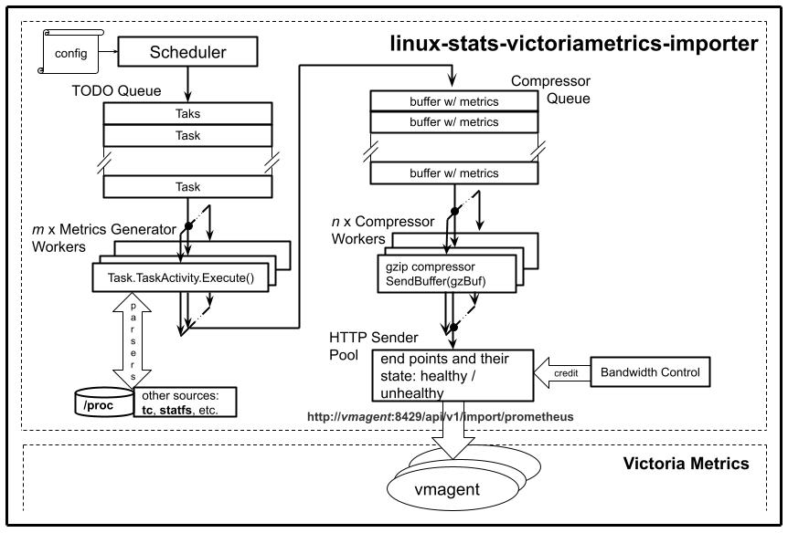

# LSVMI Internals

## Architecture

### Diagram



### Components

#### Scheduler

The scheduler is responsible for determining the next (the  nearest in time, that is) task that needs to be done. A task is an encapsulation of a metrics generator, responsible for metrics that are configured as a group. The metrics generators are generally grouped by source, e.g. `/proc/stat`, `/proc/PID/{stat,status,cmdline}`, etc.

#### TODO Queue

A Golang channel storing the tasks, written by the **Scheduler** and read by workers. This allows the parallelization of metrics generation.

#### Task, TaskActivity And Metrics Generators

The **Task** is the abstraction used for scheduling. It contains a **TaskActivity** which, for scheduling purposes, is an interface with an `Execute` method.

In its actual implementation the **TaskActivity** is a metrics generator with its context, most notably the cache of previous values used for deltas.

Each generator uses parsers for reading [/proc](https://man7.org/linux/man-pages/man5/proc.5.html) or other source of information which it later formats into [Prometheus exposition text format](https://github.com/prometheus/docs/blob/main/content/docs/instrumenting/exposition_formats.md#text-based-format).

The generated metrics are packed into buffers, until the latter reach ~ 64k in size (the last buffer of the scan may be shorter, of course). The buffers are written into the **Compressor Queue**

#### Compressor Queue

A Golang channel with metrics holding buffers from all metrics generator functions, which are its writers. The readers are gzip compressor workers. This approach has 2 benefits:

- it supports the parallelization of compression
- it allows more efficient packing by consolidating metrics across all generator functions, compared to individual compression inside the latter.

#### Compressor Workers

They perform gzip compression until either the compressed buffer reaches ~ 64k in size, or the partially compressed data becomes older than N seconds (time based flush, that is). Once a compressed buffer is ready to be sent, the compressor uses **SendBuffer**, the sender method of the **HTTP Sender Pool**, to ship it to an import end point.

#### HTTP Sender Pool

The **HTTP Sender Pool** holds information and state about all the configured **VictoriaMetrics** end points. The end points can be either healthy or unhealthy. If a send operation fails, the used end point is moved to the unhealthy list. The latter is periodically checked by health checkers and end points that pass the check are moved back to the healthy list. **SendBuffer** is a method of the **HTTP Sender Pool** and it works with the latter to maintain the healthy / unhealthy lists. The **Compressor Workers** that actually invoke **SendBuffer** are unaware of these details, they are simply informed that the compressed buffer was successfully sent or that it was discarded (after a number of attempts). The healthy end points are used in a round robin fashion to spread the load across all of the VictoriaMetrics import end points.

#### Bandwidth Control

The **Bandwidth Control** implements a credit based mechanism to ensure that the egress traffic across all **SendBuffer** invocations does not exceed a certain limit. This is useful in smoothing bursts when all metrics are generated at the same time, e.g. at start.

## Implementation Considerations

### The Three Laws Of Stats Collection

1. **First Do No Harm:** The collectors should have a light footprint in terms of resources: no CPU or memory hogs[^1], no I/O blasters, no DDoS attack on the metrics database,  etc. Anyone who has had the computer rendered irresponsive by a "lightweight" virus scanner, will intuitively understand and relate.
1. **Be Useful:** Collect only data that might have a use case.
1. **Be Comprehensive:** Collect **all** potentially useful data, even if it may be needed once in the lifetime of the system; that single use may save the day.

### Resource Utilization Mitigation Techniques

#### Custom Parsers

##### Minimal Parsing

Most stats are presented in text format via [procfs](https://linux.die.net/man/5/proc) file system. The generated metrics are also in text format, stored in `[]byte` buffers. For parsed data used as-is, either as label or metric values, the most efficient parsing is none whatsoever, in that the file is read into a `[]byte` buffer and the parser simply splits it into `[][]byte` fields.

##### Reusable Objects And The Double Buffer

Typical stats parsers will create and return a new object w/ the parsed data for every invocation. However most of the stats have a fixed structure [^2] so the data could be stored in a previously created object, thus avoiding the pressure on the garbage collector.

Additionally certain metrics generators may need to refer the previous scan values. The double buffer approach will rely on a `parser [2]*ParserType` array in the generator context together with a `currentIndex` integer that's toggled between `0` and `1` at every scan. `parser[currentIndex]` will be passed to the parser to retrieve the latest data and `parser[1 - currentIndex]` will represent the previous scan.

For the reason above custom parsers were created under the [procfs](../procfs).

#### Handling Counters

Counters are typically used for deltas and rates, rather than as-is. While the time series database can compute those in the query, there are 2 issues with storing counters directly:

- most counters are `uint64` while Prometheus values are `float64`. Converting the former to the latter results in a loss of precision for large values that may generate misleading 0 deltas.
- counters may roll over resulting in unrealistic, large in absolute value, negative deltas and rates, due to the `float64` arithmetic.

`Golang` native integer arithmetic handles correctly the rollover, e.g.

```go

package main

import (
    "fmt"
    "math"
)

func main() {
    var crt, prev uint64 = 0, math.MaxUint64
    fmt.Println(crt - prev)
}

```

correctly prints `1`. For those reasons metrics based on counters are published as deltas or rates.

#### Reducing The Number Of Data Points

##### Partial V. Full Metrics

In order to reduce the traffic between the importer and the import endpoints, only the metrics whose values have changed from the previous scan are being generated and sent. Pedantically that would require that queries be made using the [last_over_time(METRIC[RANGE_INTERVAL])](https://prometheus.io/docs/prometheus/latest/querying/functions/#aggregation_over_time) function; in practice **Grafana** and **VictoriaMetrics** query interface will have a look-back interval > _RANGE_INTERVAL_ so in most cases `last_over_time` is not needed.

To make the range interval predictable, all metrics generator are configured with 2 parameters: `interval` and `full_metrics_factor` and each metric is guaranteed to be sent over a `interval` x `full_metrics_factor`, regardless of its lack of change from the previous scan.

For each metric or small group of metrics there is a `cycle#`, incremented modulo `full_metrics_factor` after each generation. When the counter reaches 0, a full metrics cycle will ensue. In order to spread the full metrics cycles evenly across all metrics (to avoid bursts), the `cycle#` is initialized from an auto-incrementing global counter.

It should be noted that for delta values the partial approach is implemented as no-zero-after-zero, i.e. if the current and previous deltas are both 0 then the current metric is skipped, except for full cycle of course.

**Note:** The partial approach can be disabled by setting the `full_metrics_factor` to 0.

##### Active Processes/Threads

In addition to the change only approach, process/thread metrics use the concept of active process to further reduce the number of metrics. PIDs/TIDs are classified into active/inactive based upon whether they used any CPU since the previous scan. Inactive processes/threads are ignored for partial cycles.

##### Pseudo-categorical Metrics

A canonical implementation for categorical metrics has a value of `1` for the current combination of labels and `0` for all others. For instance `proc_pid_stat_state` has `state` label with possible values from the `RSDZTW` choices. A `R` running process should be describes by the following set:

```text

proc_pid_stat_state{state="R"} 1 TIMESTAMP1
proc_pid_stat_state{state="S"} 0 TIMESTAMP1
proc_pid_stat_state{state="D"} 0 TIMESTAMP1
proc_pid_stat_state{state="Z"} 0 TIMESTAMP1
proc_pid_stat_state{state="T"} 0 TIMESTAMP1
proc_pid_stat_state{state="W"} 0 TIMESTAMP1

```

If in the next scan the process transitions to `S`, the set becomes:

```text

proc_pid_stat_state{state="R"} 0 TIMESTAMP2
proc_pid_stat_state{state="S"} 1 TIMESTAMP2
proc_pid_stat_state{state="D"} 0 TIMESTAMP2
proc_pid_stat_state{state="Z"} 0 TIMESTAMP2
proc_pid_stat_state{state="T"} 0 TIMESTAMP2
proc_pid_stat_state{state="W"} 0 TIMESTAMP2

```

Rather than generating `N = N1 * N2 * N3 * ... * Nk` metrics everytime (`k` categories, each with `Nj` possible values), the pseudo-categorical approach handles transitions by invalidating the previous state by publishing `0` at the same time when the new state is published with `1` value.

The transition above `R` -> `S` becomes:

```text

proc_pid_stat_state{state="R"} 1 TIMESTAMP1

```

```text

proc_pid_stat_state{state="R"} 0 TIMESTAMP2
proc_pid_stat_state{state="S"} 1 TIMESTAMP2

```

While this reduces the number of data points, queries should be a little more complex, for instance to determine the state:

```text

last_over_time(proc_pid_stat_state) > 0

```

[^1]: Except for `VSZ` (the virtual size), Go runtime allocates a large size upfront as per [A note about virtual memory](https://go.dev/doc/gc-guide#A_note_about_virtual_memory): `Because virtual memory is just a mapping maintained by the operating system, it is typically very cheap to make large virtual memory reservations that don't map to physical memory.`

[^2]: The fixed structure applies for a given kernel version, i.e. it is fixed for the uptime of a given host.
