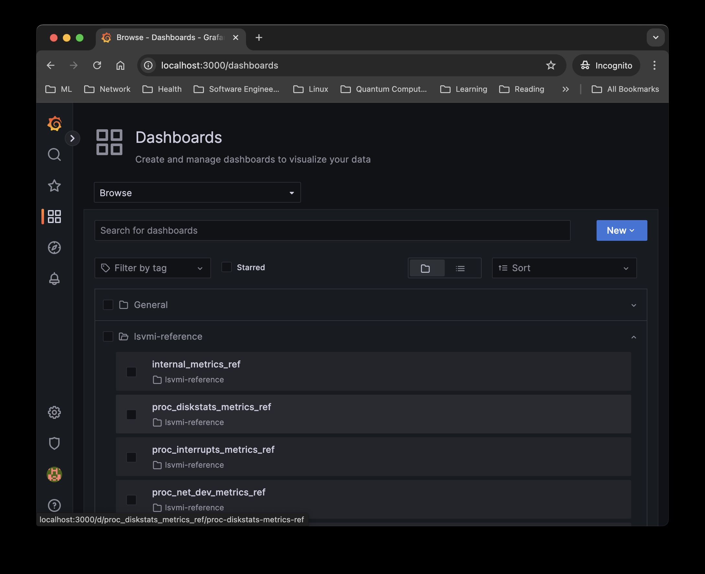

# LSVMI Proof Of Concept Demo

<!-- TOC tocDepth:2..3 chapterDepth:2..6 -->

- [Note](#note)
- [TL;DR: Quick Start For PoC](#tldr-quick-start-for-poc)
  - [Using A Linux Server](#using-a-linux-server)
  - [Using A Containerized Solution](#using-a-containerized-solution)
- [Browsing The Reference Dashboards](#browsing-the-reference-dashboards)

<!-- /TOC -->

## Note

While this is intended as a `TL;DR`, some familiarity with the following is required:

- [Prometheus Metrics](https://prometheus.io/docs/concepts/data_model/)
- [VictoriaMetrics / Single version](https://docs.victoriametrics.com/single-server-victoriametrics/)
- [Grafana](https://grafana.com/docs/grafana/latest/getting-started/)
- [LSVI Metrics](metrics.md)

Or one could just dive in and get all the way to the reference dashboards just by following the instructions.

## TL;DR: Quick Start For PoC

The **PoC** requires an instance of [VictoriaMetrics](https://docs.victoriametrics.com/single-server-victoriametrics/), [Grafana](https://grafana.com/docs/grafana/latest/getting-started/) and [LSVMI](../README.md) running on the same Linux server or container.

### Using A Linux Server

- **NOTE!** The instructions below refer to semver, OS and architecture. Each shell command block is supposed to have been prefixed by the following definitions:

    ```bash

    lsvmi_os_arch=linux-amd64
    lsvmi_ver=v0.0.1

    ```

- extract the infra installation archive:

    ```bash
    
    cd /tmp
    curl \
            -s \
            -L \
            https://github.com/emypar/linux-stats-victoriametrics-importer/releases/download/$lsvmi_ver-poc-infra/lsvmi-poc-infra-$lsvmi_ver.tgz | \
        tar xfz -

    ```

- install the **PoC** supporting [VictoriaMetrics](https://docs.victoriametrics.com/single-server-victoriametrics/) and [Grafana](https://grafana.com/docs/grafana/latest/getting-started/) under `$HOME/lsvmi-poc`, using `$HOME/lsvmi-poc/runtime` as working area for databases, logs, etc.:

    ```bash
    
    cd /tmp/lsvmi-poc-infra-$lsvmi_ver
    ./install-lsvmi-infra.sh

    ```

    If a different location is desired, the installer supports specific locations for both the directories above:

    ```text
    Usage: install-lsvmi-infra.sh [-r POC_ROOT_DIR] [-R POC_RUNTIME_DIR]

    Install VictoriaMetrics & Grafana under POC_ROOT_DIR, default: /home/ubuntu/lsvmi-poc,
    using POC_RUNTIME_DIR as runtime dir, default: POC_ROOT_DIR/runtime.
    ```

    Optional cleanup:

    ```bash
    
    cd
    rm -rf /tmp/lsvmi-poc-infra*
    
    ```

- install the desired release for OS, architecture and version under the same **PoC** location:

    ```bash

    cd $HOME/lsvmi-poc
    curl \
            -s \
            -L \
            https://github.com/emypar/linux-stats-victoriametrics-importer/releases/download/$lsvmi_ver-$lsvmi_os_arch/lsvmi-$lsvmi_os_arch-$lsvmi_ver.tgz | \
        tar xzf -
    ln -fs lsvmi-$lsvmi_os_arch-$lsvmi_ver lsvmi

    ```

- start everything:

    ```bash

    cd $HOME/lsvmi-poc      # or POC_ROOT_DIR if custom dir
    ./start-poc.sh          # logs and output under runtime/

    ```

- point a, preferably Chrome (may be in Incognito mode), browser to http://_linux_host_:3000 for [Grafana](https://grafana.com/docs/grafana/latest/getting-started/) UI, user: `admin`, password: `lsvmi`

- gracefully shutdown **PoC** to save [VictoriaMetrics](https://docs.victoriametrics.com/single-server-victoriametrics/) time series and.or [Grafana](https://grafana.com/docs/grafana/latest/getting-started/) custom dashboards:

    ```bash

    cd $HOME/lsvmi-poc
    ./stop-poc.sh

    ```

Cleanup:

   ```bash

   rm -rf $HOME/lsvmi-poc   # or rm -rf POC_ROOT_DIR POC_RUNTIME_DIR if custom dirs

   ```

### Using A Containerized Solution

- have  [Docker](https://docs.docker.com/get-started/get-docker/) installed
- run the demo image:
  - without persistence (neither [VictoriaMetrics](https://docs.victoriametrics.com/single-server-victoriametrics/) time series nor [Grafana's](https://grafana.com/docs/grafana/latest/getting-started/) custom dashboards will be saved between container restarts):

    ```bash

    docker run \
        --rm \
        --detach \
        --publish 3000:3000 \
        --publish 8428:8428 \
        --name lsvmi-demo \
        emypar/linux-stats-victoriametrics-importer:demo

    ```

  - with persistence:
    - select a convenient location:

        ```bash

        lsvmi_runtime_dir=$HOME/docker/volumes/lsvmi-poc/runtime

        ```

    - start the container with a volume:

        ```bash

        mkdir -p $lsvmi_runtime_dir
        docker run \
            --rm \
            --detach \
            --publish 3000:3000 \
            --publish 8428:8428 \
            --name lsvmi-demo \
            --volume $lsvmi_runtime_dir:/volumes/runtime \
            emypar/linux-stats-victoriametrics-importer:demo

        ```

    - log files are now accessible on the host running **Docker**:

        ```bash

        cd $lsvmi_runtime_dir/victoria-metrics/out
        cat victoria-metrics.err

        ```

        ```bash

        cd $lsvmi_runtime_dir/grafana/log
        cat grafana.log

        ```

        ```bash

        cd $lsvmi_runtime_dir/lsvmi/log
        cat linux-stats-victoriametrics-importer.log

        ```

- point a, preferably Chrome (may be in Incognito mode), browser to <http://localhost:3000> for [Grafana](https://grafana.com/docs/grafana/latest/getting-started/) UI, user: `admin`, password: `lsvmi`

- it is a good practice to stop the container gracefully, really required if the persistent volume is used:

    ```bash

    docker \
        kill --signal='SIGTERM' \
        $(docker ps --filter name=lsvmi-demo --format "{{.ID}}")

    ```

- to log on the container, run:

    ```bash

    docker exec -it lsvmi-demo bash --login

    ```

## Browsing The Reference Dashboards

Once the **PoC** is up and running, the [LSVMI](../README.md) relevant dashboards can be found under `lsvmi-reference` folder. Note that they are  [provisioned dashboards](https://grafana.com/docs/grafana/latest/administration/provisioning/#dashboards) and as such they cannot be modified directly.


